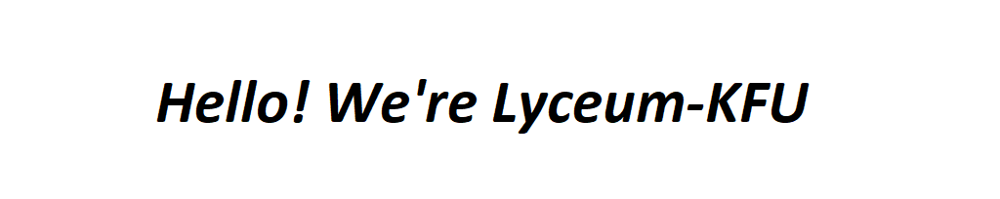

 

We're a backend and software developers

**About us**

- A students from Russia

- Graduated from two courses at Yandex Lyceum

**Our skills**

- Development in Python Django, Flask, pygame

- SQL SQLite

- C# Visual Studio WPF

#### Projects

